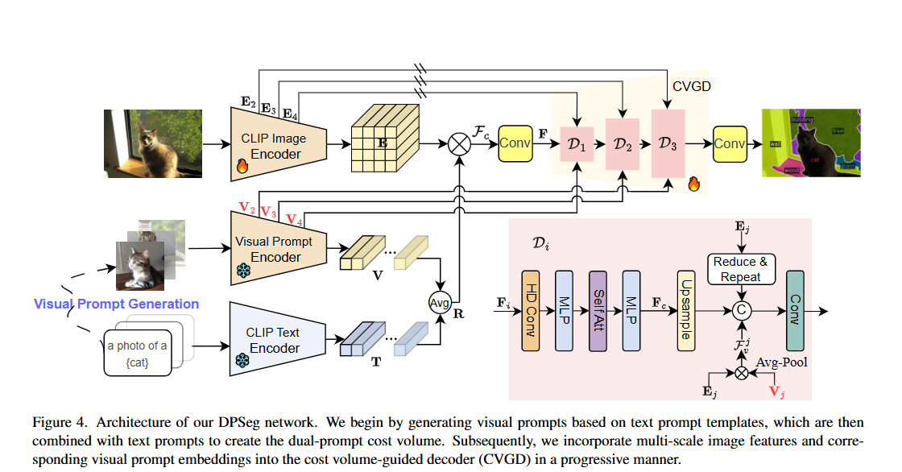

# 论文阅读 
## DPSeg: Dual-Prompt Cost Volume Learning for Open-Vocabulary Semantic Segmentation

Open-Vocabulary Semantic Segmentation（OVSS）：开放词汇语义分割

[Contrastive Language-Image Pre-training（CLIP）：对比语言-图像预训练](https://blog.csdn.net/likuoelie/article/details/152820331)

### 一些概念

1. 代价体积（Cost Volume）：是立体视觉或多视角立体视觉中常用的概念，用于表示不同深度假设下的匹配代价。它可以帮助计算图像中每个像素的深度信息。代价体积是一个三维张量，其中每个元素表示某个像素在不同深度假设下的匹配代价。这个代价通常反映了参考图像中的像素与源图像中对应像素的匹配程度。在本论文中，代价体积直接关联了图像的空间信息与类别的语义信息，其维度为$\mathbb{R}^{H \times W \times K \times M}$，（H、W为图像特征图的高和宽，K为类别总数，M为每个类别的提示模板数量）。代价体积中(x,y,k,m)位置的元素值直接量化了 “(x,y)像素属于第 k 类、匹配第 m 个模板语义” 的概率。

### 本文创新点

利用视觉提示，弥补原本只用文本提示的跨模态的不足。

视觉提示：由文本提示输入预训练的Stable Diffusion模型生成。

两个讨论：
（1）验证了图像与文本Embedding的模态差距
（2）验证了生成的视觉提示在语义分割中的有效性

#### 模型结构

DPSeg：包括三个核心组件： 

（1）双提示代价体积生成器（Dual-Prompt Cost Volume Generation）

首先基于文本提示，采用预训练的 Stable Diffusion 模型生成视觉提示，然后将其与文本提示（都经过encoder）相结合（同时利用文本提示和视觉提示，结合的方式是将他们平均化），创建双提示代价体$\mathcal{F}_c$，然后以渐进的方式将多尺度图像特征和相应的视觉提示Embedding整合到代价体引导解码器（CVGD）中。

双提示代价体具体计算公式为：

$$
\mathcal{F}_c(x,y,k,m) = \frac{\mathbf{E}(x,y) \cdot \mathbf{R}(k,m)}{\|\mathbf{E}(x,y)\| \|\mathbf{R}(k,m)\|}
$$

$\mathcal{F}_c$表示在(x,y)位置的像素点与第k类别第m个提示模板的余弦匹配度，值越大，说明该像素点属于第k类且匹配第m个提示模板语义的可能性越高。

之后，将$\mathcal{F}_c$输入一个卷积层，卷积层的核心处理操作是独立切片卷积。具体而言，将$\mathcal{F}_c$沿“类别 - 模板维度（K × M）” 切分为 K × M 个独立的“空间特征切片”，每个切片对应“单一类别k + 单一模板m”，维度为H × W，切片内容是该类别 - 模板组合下，所有像素(x,y)的余弦匹配度。然后，为每个切片应用一个独立的卷积层，生成代价体积Embedding，维度为$(H \times W) \times K \times d_F$。

独立切片卷积与维度重构的组合，是在开放词汇分割任务中平衡 “语义特异性” 与 “操作可行性” 的一个优秀设计。

（2）代价体积引导解码器（Cost Volume-Guided Decoder）

代价体积引导解码器集成来自图像和视觉提示的多尺度代价体积（$\mathbf{E}_j \in \mathbb{R}^{H_j \times W_j \times D_j}, \mathbf{V}_j \in \mathbb{R}^{H_j \times W_j \times K \times M \times D_j}$）来指导分割图预测。

（3）语义引导提示优化（Semantic-Guided Prompt Refinement）

核心逻辑是通过 “两阶段推理”，利用第一阶段的初步分割结果优化第二阶段的提示嵌入，让提示与图像实际语义更匹配。