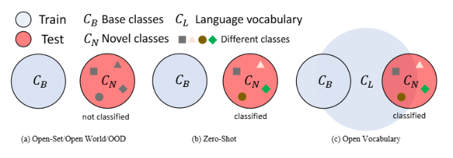
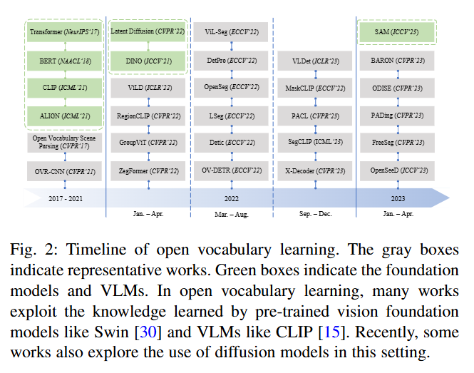
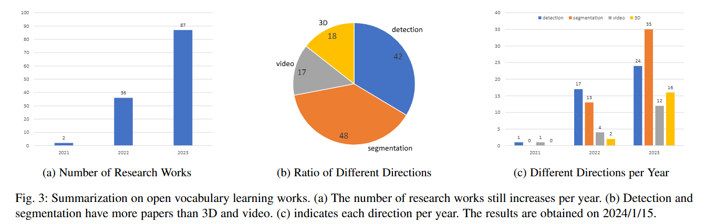

# 论文阅读 
## Plug-in Feedback Self-adaptive Attention in CLIP for Training-free Open-Vocabulary Segmentation

Open-Vocabulary Segmentation（OVSS）：开放词汇分割

Training-free：无训练

[Contrastive Language-Image Pre-training（CLIP）：对比语言-图像预训练](https://blog.csdn.net/likuoelie/article/details/152820331)

## 一些概念

1. [object detection(目标检测)](https://blog.csdn.net/yegeli/article/details/109861867)：目标检测的任务是找出图像中所有感兴趣的目标（物体），确定它们的类别和位置，是计算机视觉领域的核心问题之一。由于各类物体有不同的外观、形状和姿态，加上成像时光照、遮挡等因素的干扰，目标检测一直是计算机视觉领域最具有挑战性的问题。

2. Open-Set Learning(开集学习)：训练集类别都来自基本类别，验证集类别只多出了“unknown”类别，也就是仅需将新类标记为 “unknown”，无需分类新类。

3. Open World Learning：一种面向动态真实环境的机器学习范式，核心目标是让模型能够增量识别和学习新类别，无需对系统进行完全重新训练，以适配现实场景中类别不断涌现的特性。

4. Out-of-Distribution Detection(分布外检测，OOD)：一种聚焦于识别与训练数据分布不同的数据的技术，核心目标是让模型在测试阶段能够检测出未在训练分布中出现的样本，避免对这类样本做出错误预测。

5. Zero-Shot Learning：与开集学习类似，但要求模型能识别新类别。

## 背景
### 概念定义

传统监督学习模型默认**训练数据与测试数据共享相同的“闭集标签空间”**（即测试时遇到的类别必须在训练集中预定义）。但该假设在真实场景中存在致命缺陷：  
- 无法扩展到新类别：若真实场景中的物体类别远超训练集（如COCO仅80类，而自然场景物体类别数以千计），模型无法识别未预定义的新类；  
- 标注成本矛盾：为覆盖所有可能类别需海量标注，成本极高且不现实。  

为突破这一局限，研究者提出了**开放集学习（Open-Set Learning）、零样本学习（Zero-Shot Learning）** 等概念，最终演进到更通用的**开放词汇学习（Open Vocabulary Learning）**。

####  一、核心符号定义
为统一后续讨论，文档定义了两类关键类别集合，贯穿所有概念：  
- **基类（Base Classes, \(C_B\)）**：训练阶段可获取标注数据的类别，模型可通过基类学习视觉特征与类别映射；  
- **新类（Novel Classes, \(C_N\)）**：训练阶段无标注数据的类别，模型需在推理阶段识别此类别。  

注：新类有时也被称为“分布外样本（Out-of-Distribution Examples）”，但需注意与“分布外检测（OOD）”的概念区分（后续详述）。

#### 二、开放词汇学习的正式定义（数据与数学视角）
开放词汇学习的核心目标是：让模型在基类上训练后，能同时识别基类与新类，关键在于引入**视觉相关的语言数据（如image-caption、视觉语言模型词嵌入）** 作为辅助监督，突破标注空间限制。其定义从“数据构成”角度可严格表述为：

1. 训练数据（\(D_{train}\)）
训练数据集是**视觉-标签-语言三元组的集合**，形式为：  
\[ D_{train} = \{(x_1, y_1, l_1), (x_2, y_2, l_2), ..., (x_n, y_n, l_n)\} \]  
各组件含义如下：  
- \(x_i\)：视觉输入，根据任务类型可为图像（如检测/分割）或视频（如视频理解）；  
- \(y_i\)：视觉标签，不仅包含类别标签，还可能包含视觉定位信息（如检测任务的 bounding box、分割任务的 mask），且**仅来自基类\(C_B\)**；  
- \(l_i\)：视觉相关的语言词汇数据，是开放词汇学习的核心创新，主要来源包括：  
  - 图像描述（Image Captions）：如“一只黑色的猫坐在沙发上”，包含新类名称、属性等信息；  
  - 视觉语言模型（VLM）的词嵌入：如CLIP的文本编码器输出的类别名称嵌入（如“cat”“sofa”的向量表示）；  
- \(C_L\)：语言词汇空间，即\(l_i\)的来源集合。需注意：  
  - \(C_L\) **不强制包含\(C_B\)或\(C_N\)**：语言词汇可能未覆盖所有视觉类别；  
  - \(C_L\)可包含预定义新类之外的词汇（如属性、动作），进一步扩展模型泛化能力。

2. 评估数据（\(D_{eval}\)）
评估数据集是**视觉-标签对的集合**，形式为：  
\[ D_{eval} = \{(x_1', y_1'), (x_2', y_2'), ..., (x_m', y_m')\} \]  
核心特点：  
- 标签\(y_i'\) **同时包含基类\(C_B\)与新类\(C_N\)**，即\(y_i' \in C_B \cup C_N\)；  
- 模型需在推理时预测\(x_i'\)的标签，并覆盖基类与新类，而非将新类归为“背景”或“未知”。

#### 三、开放词汇学习与四类相似概念的核心差异
文档明确对比了开放词汇学习与**开放集学习、开放世界学习、分布外检测、零样本学习**的区别，核心差异体现在“目标、训练数据、评估数据”三方面，具体如下：

##### 1. 开放集学习（Open-Set Learning）
##### 核心目标
- 仅需“分类已知类（\(C_B\)）+ 拒绝未知类”，无需对未知类进行具体分类；  
- 场景假设：测试时可能遇到训练中未见过的类别，但无需后续学习这些类别。

##### 数据定义
- 训练数据：仅包含基类视觉-标签对，无语言数据，即\(D_{train} = \{(x_1, y_1), ..., (x_n, y_n)\}, y_i \in C_B\)；  
- 评估数据：标签包含基类与“单一未知类标记\(u\)”，即\(D_{eval} = \{(x_1', y_1'), ..., (x_m', y_m')\}, y_i' \in C_B \cup \{u\}\)，其中\(u\)代表所有未知类，不区分具体新类。

##### 与开放词汇的关键差异
- 开放集仅“拒绝未知类”，开放词汇需“识别并分类新类”；  
- 开放集无语言数据辅助，开放词汇依赖\(C_L\)扩展类别覆盖。

##### 2. 开放世界学习（Open World Learning）
##### 核心目标
- 应对真实世界的“动态类别演进”：不仅要识别已知类、发现未知类，还需**增量学习新类（人类标注后）**，无需全量重训模型；  
- 核心过程：分类已知类→识别未知类→人类标注未知类→增量更新模型，循环迭代。

##### 数据定义（分阶段）
假设学习过程包含\(T\)个步骤（\(t \in \{1,2,...,T\}\)）：  
- 第\(t\)步训练数据：仅包含第\(t\)步新增的标注数据，即\(D_{train}^t = \{(x_1^t, y_1^t), ..., (x_{n_t}^t, y_{n_t}^t)\}, y_i^t \in C_{label}^t\)（\(C_{label}^t\)为第\(t\)步新增标注类别）；  
- 第\(t\)步已知类集合：累积当前及所有历史步骤的标注类别，即\(C_B^t = \cup_{k=0}^t C_{label}^k\)；  
- 第\(t\)步评估数据：输入\(x_i'\)固定（确保增量学习连续性），标签包含\(C_B^t\)与\(u\)，即\(y_i'^t \in C_B^t \cup \{u\}\)。

##### 与开放词汇的关键差异
- 开放世界聚焦“增量学习新类”，需处理“灾难性遗忘”（学习新类时忘记旧类）；  
- 开放词汇不要求“增量更新”，更关注通过语言数据一次性扩展类别覆盖，无需分阶段学习。

##### 3. 分布外检测（Out-of-Distribution Detection, OOD）
##### 核心目标
- 识别“与训练数据分布不同”的样本（OOD样本），不关注“类别是否已知”，仅关注“数据分布差异”；  
- 场景假设：OOD样本可能是已知类的异常样本（如扭曲的“猫”图像），也可能是新类样本，但核心是“分布偏离”。

##### 数据定义
- 训练数据：来自分布\(P_{train}(X,Y)\)的视觉-标签对，无语言数据；  
- 测试数据：包含“分布内样本（来自\(P_{train}\)）”与“OOD样本（来自\(P_{OOD}(X')\)）”，模型需检测OOD样本（如标记为“异常”）。

##### 评估指标
- 基于模型置信度：如Softmax概率、熵值等，判断样本是否属于训练分布。

##### 与开放词汇的关键差异
- OOD关注“分布差异”，开放词汇关注“类别扩展”；  
- OOD无需分类OOD样本，开放词汇需分类新类（即使新类属于训练分布内）。

##### 4. 零样本学习（Zero-Shot Learning, ZSL）
##### 核心目标
- 识别训练中未见过的新类（\(C_N\)），但**无任何视觉或语言辅助数据**，仅依赖预定义的新类词嵌入（如Word2Vec向量）；  
- 局限性：新类识别完全依赖文本嵌入，忽略视觉信息关联，性能较差。

##### 数据定义
- 训练数据：仅包含基类视觉-标签对，无语言数据，即\(D_{train} = \{(x_1, y_1), ..., (x_n, y_n)\}, y_i \in C_B\)；  
- 评估数据：仅包含新类视觉-标签对，即\(D_{eval} = \{(x_1', y_1'), ..., (x_m', y_m')\}, y_i' \in C_N\)。

##### 与开放词汇的关键差异
- ZSL无语言辅助数据（仅用预定义词嵌入），开放词汇可利用image-caption、VLM等丰富语言数据；  
- ZSL评估数据仅含新类，开放词汇评估数据含基类+新类，更贴近真实场景。

核心总结如下：  
| 概念                | 新类预测方式                | 核心依赖                |  
|---------------------|-----------------------------|-------------------------|  
| 开放集/OOD/开放世界 | 标记为“unknown”（单一颜色） | 无语言数据              |  
| 零样本学习          | 分类为具体新类（多颜色）    | 预定义词嵌入            |  
| 开放词汇学习        | 分类为具体新类（多颜色）    | 大规模语言词汇\(C_L\)   |  

### 发展历程

#### 一、发展背景与起源：从场景解析到多模态预训练
开放词汇学习的概念并非凭空出现，而是源于对“真实场景中类别数量远超数据集预定义类别”这一痛点的持续探索，其起源可追溯至两方面技术积累：

##### 1. 早期场景解析的概念萌芽（2017年）
在开放词汇设置提出前，场景理解领域已面临“类别覆盖不足”的挑战——传统模型受限于数据集（如COCO仅80类），无法定位和分类真实场景中的任意物体。为突破这一限制，**开放词汇在场景理解中的概念首次源于工作**，该工作构建了“图像像素-词汇概念”的联合嵌入框架，并将概念进行层次化划分，初步探索了视觉特征与语言词汇的关联，为后续开放词汇学习奠定了“视觉-语言结合”的核心思想。

##### 2. 多模态预训练的技术推动（BERT之后）
随着自然语言处理（NLP）领域 **BERT（NAACL’18）** 的兴起，多模态预训练（尤其是视觉-语言预训练）成为研究热点。BERT的双向Transformer架构证明了“预训练-微调”范式在语言理解中的有效性，这一思路被迁移至视觉领域——研究者意识到，通过大规模图像-文本对预训练，可建立视觉特征与语言词汇的通用关联，进而突破闭集类别限制。这一技术趋势直接推动了开放词汇学习从“概念萌芽”走向“具体任务落地”。

#### 二、关键里程碑与时间线（核心工作与技术突破）
图2呈现了开放词汇学习的时间线，核心里程碑按“概念提出→技术奠基→任务扩展→基础模型融合”四个阶段展开，关键工作及贡献如下：

##### 1. 概念提出阶段（2021年）：开放词汇任务首次落地
- **开放词汇目标检测的诞生**：受视觉-语言预训练启发，**OVR-CNN（CVPR’21）** 首次提出“开放词汇目标检测（Open-Vocabulary Object Detection）”概念。该方法通过caption数据（图像描述）建立“新类语义”与“视觉区域”的关联，将ResNet与视觉-语言（V2L）层结合，用预训练语言模型（BERT）的文本嵌入替换固定分类器，实现了基类训练、新类推理的能力。
- **多模态预训练模型开源**：同年，**CLIP（ICML’21）** 被提出并开源，其通过大规模图像-文本对（如LAION-5B）预训练，实现了视觉特征与语言特征的跨模态对齐。CLIP的出现为开放词汇学习提供了“通用视觉-语言知识底座”，后续多数方法均基于CLIP进行改进。

##### 2. 技术奠基阶段（2022年）：核心方法与任务扩展
2022年是开放词汇学习的“技术爆发年”，领域从“单一检测任务”扩展至分割任务，并形成了“知识蒸馏、视觉-语言对齐”等核心技术思路：
- **开放词汇检测的知识蒸馏实践**：**ViLD（ICLR’22）** 首次将CLIP的知识蒸馏至闭集检测器（Faster R-CNN），通过“文本分支（固定CLIP文本嵌入）+图像分支（RoI特征蒸馏）”实现新类检测，证明了“利用预训练VLM知识提升开放词汇性能”的有效性。
- **开放词汇分割的首次探索**：**LSeg（ICLR’22）** 首次将开放词汇学习扩展至语义分割任务，通过将CLIP的文本嵌入与图像像素特征对齐，实现“语言驱动的零样本分割”，为后续开放词汇分割方法提供了“文本特征引导像素分类”的范式。
- **其他关键方法涌现**：同年，RegionCLIP（CVPR’22）通过生成“区域-文本伪标签”优化视觉-语言对齐，Detic（ECCV’22）利用ImageNet图像级监督缓解长尾问题，进一步丰富了开放词汇检测的技术体系。

##### 3. 基础模型融合阶段（2023年）：分割基础模型与LLM融合
2023年，开放词汇学习开始与“通用分割基础模型”“大语言模型（LLM）”深度融合，泛化能力进一步提升：
- **分割基础模型的零样本能力**：**SAM（ICLR’23）** 提出“分割一切（Segment Anything）”理念，通过十亿级掩码数据预训练构建通用分割模型。SAM与CLIP结合后，无需微调即可实现优秀的零样本分割性能，证明了“基础模型+VLM”在开放词汇场景中的巨大潜力。
- **大语言模型的语义增强**：随着**LLaMA（arXiv’23）** 等大语言模型的出现，开放词汇学习开始融合LLM的丰富语义知识——LLM包含远超数据集 taxonomies的文本概念（如V3Det仅13204类，而LLM覆盖的日常词汇达数万），通过将LLM与视觉模型对齐，可进一步提升零样本新类识别能力，成为领域新方向。

#### 三、研究趋势与统计特征（数量与方向分布）

图3呈现了开放词汇学习的研究趋势，核心统计特征如下：

##### 1. 研究数量：2021年后显著增长
- 如图3(a)所示，开放词汇学习的研究论文数量自2021年起呈“爆发式增长”。2021年前，该领域仅有零星探索（如2017年的场景解析工作）；2021年CLIP与OVR-CNN发布后，研究者意识到其潜力，论文数量逐年翻倍，截至2024年1月15日，领域已积累数百篇相关工作。
- 增长原因：一方面，CLIP等VLM提供了通用技术底座，降低了方法开发门槛；另一方面，开放词汇学习解决了“闭集模型类别覆盖不足”的核心痛点，符合真实场景需求，吸引了大量研究关注。

##### 2. 方向分布：检测与分割为核心，3D与视频尚待探索
- **任务占比差异**：如图3(b)所示，当前开放词汇学习的研究主要集中在**目标检测**与**分割**（语义/实例/全景分割）两大任务，两类论文数量占比超80%；而**视频理解**（如视频分类、跟踪）与**3D场景理解**（如3D检测、分割）的研究相对较少，仅占20%左右。
- **时间线分布**：如图3(c)所示，2021-2022年研究以“开放词汇检测”为主；2022年后“开放词汇分割”快速崛起；2023年开始出现“视频开放词汇理解”与“3D开放词汇理解”的探索，但仍处于起步阶段。这一分布反映了领域发展的“从2D到3D、从静态到动态”的自然趋势——研究者先在成熟的2D静态任务（检测/分割）验证方法有效性，再逐步扩展至更复杂的动态（视频）与三维（3D）任务。

#### 四、核心总结：开放词汇学习的演进逻辑
2.2节通过梳理历史脉络，揭示了开放词汇学习的核心演进逻辑：  
**从“单一视觉监督”到“视觉-语言联合监督”**——早期闭集模型依赖昂贵的视觉标注，零样本学习仅依赖预定义词嵌入；而开放词汇学习通过融合“视觉数据+语言词汇数据（caption、VLM嵌入）”，既降低了标注成本，又突破了类别覆盖限制。  
**从“任务孤立”到“基础模型统一”**——领域初期各任务（检测/分割）方法独立设计，后期通过CLIP、SAM等基础模型实现“跨任务知识共享”，逐步走向“统一开放词汇框架”。  
这一演进不仅体现了技术的进步，更反映了该领域“贴近真实场景需求”的核心目标——通过多模态融合，让模型具备“识别任意类别”的通用能力。

### 任务、数据集和指标

开放词汇学习涵盖了广泛的计算机视觉任务，包括目标检测（object detection）、分割（segmentation）、视频理解（video understanding）和三维场景理解（3D scene understanding）。

数据集

| 任务类型       | 数据集名称       | 类别数量                | 核心数据规模                | 关键特点                                                                 |
|----------------|------------------|-------------------------|-----------------------------|--------------------------------------------------------------------------|
| 目标检测       | COCO             | 80类（基48/新17）       | 32.8万张图像，66.5万基类bbox | 日常场景为主，标注密度高，开放词汇检测基础基准                            |
|                | LVIS             | 1203类（基866/新337）   | 16.4万张图像，百万级instance标注 | 侧重长尾类别（稀有类占28%），测试新类泛化能力                            |
|                | V3Det            | 13204类（基6709/新6495）| 24.3万张图像，175.3万bbox   | 类别覆盖最广（COCO的165倍），含小众/专业类别，贴近真实开放场景            |
| 图像分割       | COCO-Stuff       | 171类（80物体+91背景）  | 复用COCO 32.8万张图像       | 补充背景语义标注，解决新类与背景混淆问题                                  |
|                | ADE20k           | 全量2693类（常用A-847/A-150） | 2.6万张图像（训1.9万/验0.2万） | 覆盖室内外复杂场景，类别与场景关联性强，支持大词汇量分割测试              |
|                | PASCAL-VOC 2012  | 20类                    | 1.1万张图像，含像素级标注   | 轻量级基准，标注精准，适合快速验证模型基础泛化能力                        |
|                | PASCAL-Context   | 459类（常用PC-59子集）  | 5000张验证图像              | 细粒度类别（如“书架”“路灯”），测试低语义层级新类分割能力                  |
|                | Cityscapes       | 30类（城市场景专用）    | 5000张精细标注图像          | 聚焦自动驾驶场景，标注专业，测试结构化场景新类分割（如新型交通标志）        |
| 视频理解（分割/跟踪） | VSPW             | 124类                   | 400个视频（总时长超40小时）  | 含动态场景（遮挡/光照变化），支持视频语义分割时序稳定性测试                |
|                | YoutubeVIS       | 40类（基25/新15）       | 2800个视频片段（平均10秒）   | 视频来自YouTube，动态性强，核心视频实例分割基准                            |
|                | LV-VIS           | 1212类（基659/新553）   | 1000个视频片段              | 继承LVIS类别体系，含稀有新类，测试大词汇量视频实例分割能力                |
|                | MOSE             | 20类（高动态类别）      | 500个视频片段               | 含极端遮挡/快速运动，测试恶劣条件下新类分割鲁棒性                        |
|                | TAO              | 833类（基500/新333）    | 2000个视频片段（总时长超50小时） | 类别覆盖广，含日常/专业领域，测试多目标跟踪+新类识别联合能力              |

评估指标

| 任务类型               | 指标名称                | 核心定义                                                                 | 关键适配（数据集/场景）                          |
|------------------------|-------------------------|--------------------------------------------------------------------------|-------------------------------------------------|
| 目标检测               | mAP（mean Average Precision） | 所有类别AP（P-R曲线下面积）的均值，衡量定位+分类联合精度                   | COCO用box mAP（IoU=0.5）；LVIS用mask mAP        |
|                        | AP_base / AP_novel       | 分别计算基类、新类的AP，评估开放词汇泛化能力                              | 所有检测数据集（COCO/LVIS/V3Det）               |
|                        | AP_r / AP_c / AP_f       | LVIS专属，分别对应稀有类、常见类、频繁类的mask mAP，聚焦长尾新类性能        | LVIS数据集                                      |
| 图像分割 - 语义分割    | mIoU（mean Intersection over Union） | 所有类别IoU（交集/并集）的均值，衡量像素级分类精度                         | 全部分割数据集；拆分mIoU_B（基类）/mIoU_N（新类）|
|                        | hIoU（调和平均IoU）      | 基类与新类IoU的调和平均，平衡两者性能避免基类过拟合                       | ADE20k、ScanNet等3D/2D分割数据集                |
| 图像分割 - 实例分割    | mask-based mAP           | 结合实例mask匹配的AP，评估“实例定位+类别识别”精度                         | LVIS、COCO-Instances                            |
| 图像分割 - 全景分割    | PQ（Panoptic Quality）   | 融合语义（背景）与实例（前景）质量，公式：TP/(TP+FP/2+FN/2)               | COCO-Panoptic、ADE20k                           |
|                        | SQ/RQ                   | PQ细分：SQ（分割质量，像素准确性）、RQ（识别质量，类别正确性）             | 全景分割专属（如OVISE、OpenSeed评估）            |
| 视频理解 - 视频分类    | Top-1/Top-5准确率        | 预测Top-1/Top-5类别含真实类别的样本占比，衡量动态类别识别精度             | UCF101、Kinetics-600                           |
| 视频理解 - 分割/跟踪   | mAP + MOTA              | mAP评估新类实例识别，MOTA（多目标跟踪精度）评估帧间跟踪连续性             | LV-VIS、YoutubeVIS                              |
| 3D场景理解 - 3D识别    | Top-1/Top-3/Top-5准确率  | 3D点云/形状分类中，预测Top-1/3/5类别含真实类别的样本占比                 | ModelNet40、ScanObjectNN                        |
| 3D场景理解 - 3D检测    | mAP（3D IoU）           | 基于3D bounding box IoU计算的mAP，评估三维空间定位+分类精度               | OV-3DETIC、CoDA评测                             |
| 3D场景理解 - 3D分割    | mIoU（3D像素级）         | 3D点云像素级IoU的均值，衡量三维空间像素分类精度                           | ScanNet、nuScenes                                |

## 方法：综述
