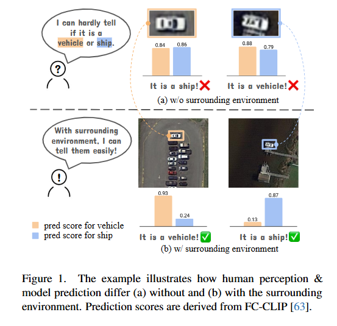
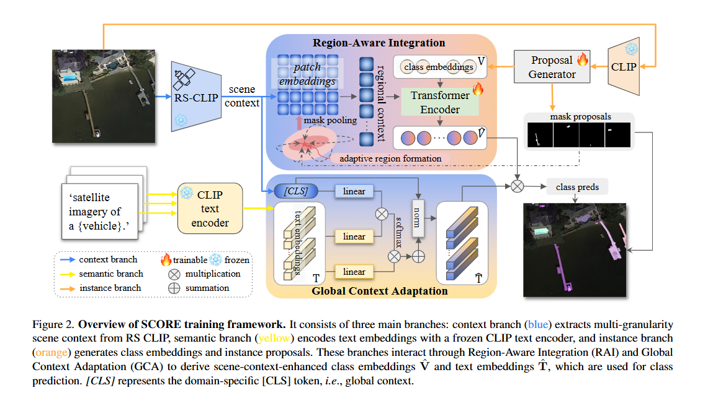
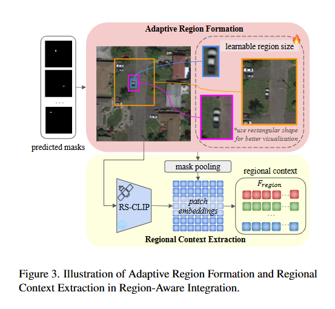
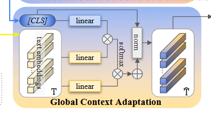
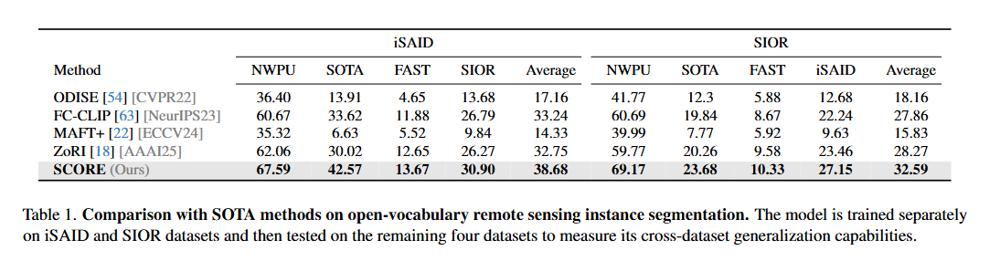
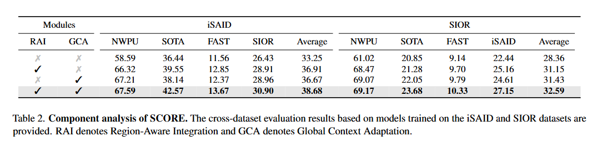
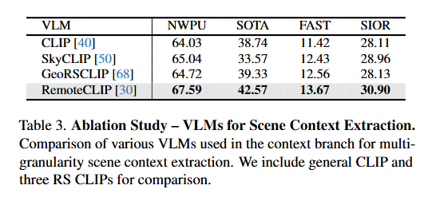
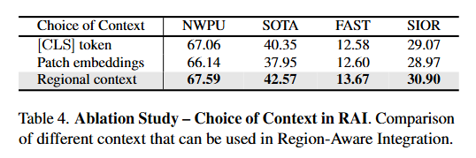
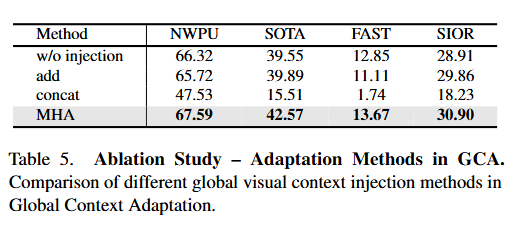
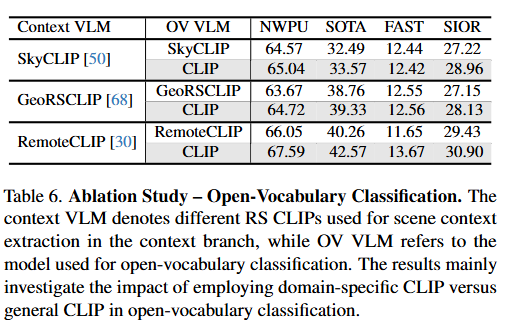

# 论文阅读 
## SCORE: Scene Context Matters in Open-Vocabulary Remote Sensing Instance Segmentation

Open-Vocabulary Remote Sensing Instance Segmentation：开放词汇遥感图像实例分割

[Contrastive Language-Image Pre-training（CLIP）：对比语言-图像预训练](https://blog.csdn.net/likuoelie/article/details/152820331)

### 背景

当前的OV分割模型在自然图像数据集上表现良好，但它们在遥感中的直接应用面临着各种挑战，如不同的景观、季节变化以及航空图像中存在小型或模糊的物体。

于是论文想到可以利用物体周围环境来判断物体类别。

现有研究在自然图像的开放词汇分割方面已经取得显著进展，也扩展到遥感领域，但现有方法仅限于语义分割，迫切需要一个开放词汇实例分割框架来应对遥感领域的挑战。

### 方法

#### 任务构成

开放词汇遥感实例分割的核心目标，是突破传统“闭词汇”遥感实例分割对预定义类别集合的依赖，实现对**未见过的新类别（Novel Categories）** 的像素级实例分割能力。具体而言，模型需在仅利用“已见类别”（训练集中的类别）数据训练的前提下，在推理阶段对“未见类别”（测试集中与训练集类别不重叠的类别）的遥感目标，同时完成两个关键任务：
（1） **实例定位与掩码生成**：为每个目标生成精确的像素级实例掩码（Instance Mask），区分同一类别的不同个体；
（2） **类别标注**：为每个实例掩码分配正确的类别标签，且该类别可来自训练集未覆盖的“开放词汇表”。

这一目标旨在解决遥感场景中类别多样性高、人工标注成本高（尤其高分辨率航拍/卫星图像）的痛点，使模型能更灵活地适应环境监测、城市规划、农业评估等多样化地球观测任务。

任务的输入为单张遥感图像，其数学形式被定义为 \(I \in \mathbb{R}^{H ×W ×3}\)

任务的输出为一组“实例掩码-类别标签”对，其数学形式被定义为 \(\left\{y_{i}\right\}_{i=1}^{K}=\left\{\left(m_{i}, c_{i}\right)\right\}_{i=1}^{K}\)，其中：
- \(K\) 代表图像中检测到的目标实例总数（数量不固定，随图像内容变化）；
- \(m_{i}\) 是第 \(i\) 个实例的像素级掩码（Instance Mask），用于精确标记该实例在图像中的像素范围；
- \(c_{i}\) 是第 \(i\) 个实例的类别标签（Category Label），取值来自“开放词汇表”，可包含训练阶段未见过的类别。

**训练与推理阶段的类别划分规则**
为严格区分“已见类别”与“未见类别”，确保任务的“开放词汇”属性，任务构成部分明确了训练与推理阶段的类别集合划分规则：
1. **训练阶段（Training Phase）**：模型仅从预定义的“已见类别集合” \(C_{train}\) 中学习，训练数据的标注类别均属于 \(C_{train}\)，模型需掌握该集合内目标的视觉特征与类别关联；
2. **推理阶段（Inference Phase）**：模型需在“未见类别集合” \(C_{test}\) 上进行评估，核心约束为 \(C_{train} \neq C_{test}\)（即训练与测试的类别集合无重叠，或仅部分重叠以测试泛化能力）。同时，规则明确“\(C_{test}\) 的类别名称在测试时可获取”——这一设定符合开放词汇学习的常规范式，即模型无需提前学习未见类别的视觉特征，但需通过类别名称的文本信息与视觉特征关联，实现类别匹配。

这一划分规则直接决定了后续实验设计的“跨数据集泛化”逻辑（如在iSAID数据集（\(C_{train}\)）上训练，在NWPU-VHR-10数据集（\(C_{test}\)）上测试），是验证SCORE框架开放词汇能力的关键前提。

#### 框架概述

整体框架如图所示，它由三个主要分支组成，上下文分支（蓝色）从RS-CLIP中提取多粒度场景上下文，语义分支（黄色）使用CLIP文本编码器对文本嵌入进行编码，实例分支（橙色）生成类别嵌入和实例提案。这些分支通过区域感知集成（RAI）和全局上下文适应（GCA）进行交互，以获得场景上下文增强的类别嵌入和文本嵌入，用于类别预测。

#### 场景上下文提取（Scene Context Extraction）

在SCORE框架中，**场景上下文提取（Scene Context Extraction）** 是上下文分支的核心操作，其核心目标是从遥感图像中精准获取**多粒度、领域特异性的场景信息**（全局场景语义与局部区域特征），为后续“区域感知融合（RAI）”和“全局上下文适配（GCA）”模块提供关键输入，最终解决遥感开放词汇实例分割中目标模糊、尺度差异大及跨领域泛化难等问题。该过程依托遥感专用视觉语言模型（RS-CLIP）实现。

场景上下文提取的设计源于遥感图像的两大核心特性，这也是其区别于自然图像上下文提取的关键：
(1) **目标与环境的强关联性**：遥感图像中，目标类别与其周围环境存在固定且明确的关联（如船舶必然关联水域、车辆多分布于道路或停车场、飞机对应机场），这种关联信息可有效辅助区分外形相似的目标（例如，仅看轮廓难以区分的车辆与船舶，结合“道路”或“水域”环境即可精准识别）；
(2) **遥感领域的特异性需求**：通用图像的上下文特征（如自然场景中的“树木-草地”关联）无法适配遥感场景的特殊性——遥感图像多为鸟瞰视角，目标尺度差异极大（从小汽车到大型体育场），且包含“港口”“农田”“建筑群”等特有场景，需专门提取符合遥感领域的上下文信息，才能支撑后续表征优化。

场景上下文提取的实现高度依赖**遥感专用视觉-语言模型（RemoteCLIP）** ，而非通用CLIP模型，选择该工具的核心原因的在于其领域适配性：
- 通用CLIP模型基于自然图像-文本对预训练，缺乏遥感领域知识，无法捕捉“鸟瞰视角下的目标形态”“遥感特有场景关联”等关键信息，提取的上下文与遥感任务脱节；
- RemoteCLIP通过遥感专用数据集预训练，能精准学习遥感场景的语义与视觉关联，其输出的上下文特征天然适配遥感实例分割任务。

框架中明确采用RemoteCLIP的ViT-L/14版本，且在提取过程中保持模型权重**冻结状态**（记为\(CLIP_{RS}^{*}\)，“*”表示冻结）——此举既能避免破坏预训练获得的遥感领域知识，又能降低训练复杂度，确保提取过程的高效性。

场景上下文提取以原始遥感图像为输入，通过RemoteCLIP的ViT图像编码器完成多层特征编码，最终输出两类核心上下文特征。

输入为单张待处理的遥感图像，其数学形式为\(I \in \mathbb{R}^{H × W × 3}\)

RemoteCLIP的ViT图像编码器采用Transformer架构，对输入图像进行**多层迭代编码**，每层编码同时生成两类特征，具体过程如下：
（1） **图像分块与嵌入生成**：首先将输入图像\(I\)分割为固定尺寸的图像补丁（如14×14像素），并为每个补丁生成对应的“补丁嵌入（Patch Embeddings）”，这些嵌入包含图像局部区域的视觉细节（如“水域的蓝色纹理”“道路的线性边缘”）；
（2） **[CLS]标记添加与联合编码**：在所有补丁嵌入的开头，额外添加一个[CLS]标记（Classification Token）——该标记不对应任何图像局部区域，而是用于聚合整幅图像的全局语义；随后，[CLS]标记与所有补丁嵌入一同输入Transformer层，经过多层自注意力机制迭代编码，逐步融合局部与全局信息。

由于Transformer深层编码的特征包含更抽象、更具语义价值的场景信息，框架选择**最后一层Transformer的输出**作为最终的场景上下文特征，具体包含两类：
- **全局上下文（Global Context）**：即最后一层输出的[CLS]标记，记为\(F_{CLS}^{final}\)，其维度为\(\mathbb{R}^{1 × C}\)（\(C\)为特征维度，ViT-L/14模型中\(C=768\)），核心作用是编码整幅图像的全局场景语义（如“这是一幅港口场景图像”“这是一幅城市建筑群图像”）；
- **局部区域上下文（Regional Context）**：即最后一层输出的补丁嵌入，记为\(F_{HW}^{final}\)，其维度为\(\mathbb{R}^{(H/14) × (W/14) × C}\)（\(H/14\)、\(W/14\)为分块后的特征图尺寸），核心作用是提供图像各局部区域的视觉细节，为后续提取目标周围的局部环境特征奠定基础。

#### 区域感知融合（Region-Aware Integration, RAI）

在SCORE框架中，**区域感知融合** 是核心创新模块之一，其设计初衷是解决遥感图像中“小目标识别难”“模糊目标区分难”的痛点。其通过动态捕捉目标与周围局部环境的关联信息（如船舶与水域、车辆与道路），将区域上下文注入类别嵌入，优化视觉表征的区分度，为开放词汇遥感实例分割的精准性提供关键支撑。

RAI模块的提出，直接针对遥感开放词汇实例分割的两大核心挑战，而这两大挑战无法通过传统实例分割方法解决：
1. **目标视觉特征模糊与尺度差异**：遥感图像多为鸟瞰视角，小目标（如小汽车、小型船舶）自身视觉特征有限，且部分目标（如车辆与船舶）外形相似，仅依赖目标自身特征难以精准区分（如图1(a)所示，无环境信息时模型易混淆车辆与船舶）；
2. **目标与环境的强关联性未被利用**：遥感场景中，目标类别与其周围局部环境存在固定关联（如船舶必位于水域、车辆多分布于道路/停车场），这种“目标-环境”关联是区分模糊目标的关键线索，但传统开放词汇分割模型（如FC-CLIP [63]）未有效利用该信息，导致泛化能力受限。

基于此，RAI模块通过“提取目标周围区域上下文→融合至类别嵌入”的逻辑，让模型能借助环境信息优化视觉表征，本质是模拟人类通过“目标+环境”判断类别的认知过程（如图1(b)所示，结合水域/停车场环境可精准区分船舶与车辆）。

RAI模块的输入来自两大分支：实例分支输出的“初始类别嵌入+实例掩码提案”，以及上下文分支输出的“局部区域上下文（补丁嵌入\(F_{HW}^{final}\)）”；输出为“区域感知类别嵌入”。整个流程分为三个关键步骤，形成“定位关联区域→提取区域信息→优化视觉表征”的闭环，具体如图3（RAI模块示意图）所示。

第一步，由于遥感目标尺度差异极大（从小汽车到大型体育场），固定尺寸的区域范围无法适配所有场景，因此RAI首先通过**可学习的膨胀机制**，动态扩展实例掩码，确保覆盖目标周围的“有效关联环境”，具体过程如下：
- **输入**：实例分支生成的初始实例掩码提案\(M = [m_1, m_2, ..., m_N] \in \mathbb{R}^{B×N×H×W}\)（其中\(B\)为批次大小，\(N\)为实例数量，\(H/W\)为图像尺寸）；
- **核心操作**：
  1. 引入**可学习膨胀因子\(\delta\)**（初始值设为1，训练过程中自适应优化），计算扩展核大小\(k\)（核大小与膨胀因子正相关，目标越大，核大小越大，扩展范围越广）；
  2. 采用**最大池化（Max-Pooling）** 对初始掩码\(M\)进行扩展：以掩码为中心，在核大小\(k\)的局部邻域\(\mathcal{N}(M,k)\)内取最大值（0表示背景，1表示目标），生成扩展后的掩码\(M'\)，公式为：  
     \[M^{\prime} = \operatorname*{max}_{x\in \mathcal{N}(M,k)}M(x)\]  
     其中，池化步长设为1、 padding设为\(k//2\)，确保扩展后的掩码与原始图像空间对齐，避免位置偏移；
- **输出**：扩展掩码\(M'\)——该掩码不仅包含目标自身像素，还覆盖了目标周围的“关联环境区域”（如船舶周围的水域、车辆周围的道路），为后续提取区域上下文划定范围。

第二步，在确定“关联环境范围（\(M'\)）”后，RAI从上下文分支输出的“局部区域上下文（补丁嵌入\(F_{HW}^{final}\)）”中，提取该范围内的环境特征，具体过程如下：
- **输入**：扩展掩码\(M'\)、上下文分支输出的补丁嵌入\(F_{HW}^{final} \in \mathbb{R}^{(H/14)×(W/14)×C}\)（\(C\)为特征维度，如ViT-L/14模型中\(C=768\)，该嵌入包含图像各局部区域的视觉细节，如水域纹理、道路边缘）；
- **核心操作**：**掩码加权池化**——对\(F_{HW}^{final}\)中位于扩展掩码\(M'\)范围内的所有补丁特征，按归一化权重\(\omega_x\)（权重由掩码内像素重要性决定，环境关键区域权重更高）进行求和，得到该目标的“区域上下文特征”，公式为：  
  \[F_{region} = \sum_{x \in M^{\prime}} \omega_x \cdot F_{HW}^{final}\]  
  其中，\(\omega_x\)通过掩码内像素值归一化得到，确保重要环境特征（如水域的蓝色纹理）对\(F_{region}\)的贡献更大；
- **输出**：区域上下文特征\(F_{region}\)——该特征浓缩了目标周围环境的语义信息（如“水域”“道路”“农田”），是区分模糊目标的关键线索。

第三步，RAI的最终步骤是将提取的\(F_{region}\)融入实例分支的初始类别嵌入，通过Transformer层实现“目标自身特征+周围环境特征”的深度融合，优化视觉表征的区分度，具体过程如下：
- **输入**：实例分支输出的初始类别嵌入\(V = [v_1, v_2, ..., v_N] \in \mathbb{R}^{N×C}\)、区域上下文特征\(F_{region}\)；
- **核心操作**：
  1. 引入\(l\)层可训练的Transformer层，将\(F_{region}\)作为“环境指导信号”，与初始类别嵌入\(V\)进行迭代融合；
  2. 融合过程通过温度系数\(\lambda\)控制\(F_{region}\)的贡献权重（避免环境信息过载或不足），公式为：  
     \[V_{i+1} = \text{TransLayer}_i(V_i, \lambda \cdot F_{region})\]  
     其中，\(i\)为Transformer层索引（\(i=1,2,...,l\)），\(\text{TransLayer}_i\)表示第\(i\)层Transformer，通过自注意力机制让类别嵌入“吸收”区域上下文信息；
- **输出**：区域感知类别嵌入\(\hat{V}\)——该嵌入同时包含目标自身的视觉特征与周围环境的语义特征，能有效区分外形相似但环境不同的目标（如“水域中的船舶”与“道路上的车辆”），且减少对训练类别的过拟合，提升对未见类别的泛化能力。

#### 全局上下文适配（Global Context Adaptation）

在SCORE框架中，**全局上下文适配（Global Context Adaptation, GCA）** 是核心创新模块之一，其设计目标是解决通用视觉语言模型（CLIP）在遥感领域的“语义鸿沟”问题——通过将遥感图像的全局场景上下文注入文本嵌入，优化分类器的领域适配性，使文本表征更精准地匹配遥感目标的视觉特征，最终提升开放词汇遥感实例分割的类别预测精度。

GCA模块的输入来自两大分支：语义分支的“初始文本嵌入”，以及上下文分支的“全局上下文（\(F_{CLS}^{final}\)）”；输出为“领域适配文本嵌入”。整个流程形成“文本表征初始化→全局上下文注入→跨模态对齐优化”的闭环，具体与框架中语义分支、上下文分支的协同关系如图2（SCORE框架总览图）所示。

为避免简单相加/拼接破坏CLIP预训练的跨模态对齐，GCA采用**多头交叉注意力（MHA）** 实现全局上下文与文本嵌入的平滑融合，让文本嵌入“吸收”遥感全局语义：
- **输入**：初始文本嵌入\(T \in \mathbb{R}^{B×M×C}\)（由冻结的CLIP文本编码器得到）、全局上下文\(F_{CLS}^{final} \in \mathbb{R}^{B×1×C}\)；
- **核心操作**：
  1. **线性投影与注意力初始化**：通过可学习的线性投影矩阵\(w_Q\)、\(w_K\)、\(w_V\)，将\(F_{CLS}^{final}\)映射为注意力查询（Q），将\(T\)映射为注意力键（K）与值（V），公式为：  
     \[Q = w_Q F_{CLS}^{final}, \quad K = w_K T, \quad V = w_V T\]  
     其中，\(w_Q, w_K, w_V\)的作用是将Q、K、V映射到相同的特征维度\(d_k\)（如\(d_k=64\)，与多头注意力的头数适配），确保注意力计算可执行；
  2. **多头交叉注意力计算**：Q（全局上下文）与K（初始文本嵌入）计算相似度，经Softmax归一化后得到注意力权重，再与V（初始文本嵌入）加权求和，生成领域适配文本嵌入\(\hat{T}\)，公式为：  
     \[\hat{T} = \text{MHA}(Q,K,V) = \text{softmax}\left(\frac{QK^T}{\sqrt{d_k}}\right)V\]  
     这一过程中，全局上下文Q会“引导”文本嵌入T关注与遥感场景相关的语义（如让“ship”的文本嵌入更关注“水域”“港口”等关键词），同时保留T的开放词汇泛化能力；
- **输出**：领域适配文本嵌入\(\hat{T} \in \mathbb{R}^{B×M×C}\)。该嵌入既包含通用CLIP的跨类别泛化能力，又融入了遥感全局场景知识，可直接作为分类器用于后续类别预测。

#### 开放词汇推理

在测试推理阶段，分类的分数是通过集成方法计算的。测试集的遥感图像中可能同时包含已见类别和未见类别（例如一张港口图像中，“ship”为已见类别，“container crane（集装箱起重机）”为未见类别），模型通过 **“双路径分类+集成决策”** 分别识别：
1. **已见类别识别：依赖RAI与GCA的协同优化**  
   对于图像中每个实例，若其真实类别属于\(C_{train}\)（已见类别），模型会调用RAI模块优化后的**区域感知类别嵌入\(\hat{V}\)**，与GCA模块优化后的**领域适配文本嵌入\(\hat{T}\)** 计算相似度（点积），得到已见类别的分类概率。这一过程利用了训练阶段RAI学习的“目标-局部环境关联”（如“ship”与“水域”的关联），确保已见类别的识别精度。

2. **未见类别识别：依赖通用CLIP的泛化能力**  
   对于图像中类别属于\(C_{test}\setminus C_{train}\)（未见类别）的实例，模型会跳过RAI模块，直接使用**实例分支的通用CLIP编码器**提取该实例的密集视觉特征，同样与GCA优化的\(\hat{T}\)计算相似度，得到未见类别的分类概率。这一过程不依赖RAI的训练优化，仅通过通用CLIP的跨模态泛化能力覆盖新类别。

3. **集成决策：确定每个实例的最终类别**  
   模型对每个实例的“已见类别概率”和“未见类别概率”进行集成（如取概率最大值），最终判定该实例属于已见类别还是未见类别，并输出对应的“实例掩码-类别标签”对。例如，某实例的“ship”（已见）概率为0.8，“container crane”（未见）概率为0.1，则判定为已见类别“ship”；若另一实例的“container crane”概率为0.7，所有已见类别概率均低于0.3，则判定为未见类别“container crane”。

### 实验
#### 数据集与评估指标

在SCORE框架的实验验证中，数据集与评估指标的设计紧密围绕“开放词汇遥感实例分割”的核心任务目标——验证模型对**未见类别**的识别能力与**跨数据集泛化**能力，确保实验结果的客观性、全面性与领域适配性。

SCORE采用“跨数据集训练-测试”范式（即训练于A数据集，测试于B/C/D等不同数据集），严格区分“已见类别集合（\(C_{train}\)）”与“未见类别集合（\(C_{test}\)）”，以模拟真实遥感场景中“模型需适应新区域、新类别”的需求。数据集选择覆盖不同遥感场景、目标尺度与类别数量，确保评估的全面性。

训练集选择两个大规模遥感实例分割数据集，为模型提供“已见类别”的视觉-语义关联学习基础，具体信息如下表所示：

| 数据集名称 | 数据来源与背景 | 图像数量（训练集） | 类别数量 | 核心类别示例 | 数据特性 |
|------------|----------------|--------------------|----------|--------------|----------|
| **iSAID**   | 基于DOTA（航拍目标检测数据集）扩展，专门用于遥感实例分割，是目前该领域规模最大的数据集之一 | 18,732张 | 15类 | 船舶（ship）、储罐（storage tank）、桥梁（bridge）、小型车辆（small vehicle）、飞机（plane）、港口（harbor）等 | - 图像分辨率高（原始尺寸多为1024×1024像素） - 目标尺度差异大（从小型车辆到大型体育场） - 覆盖城市、港口、农田等多样化遥感场景 |
| **SIOR**  | 基于DIOR（光学遥感目标检测数据集），通过SAMRS（Segment Anything Model for Remote Sensing）自动生成实例分割标注，补充遥感实例分割数据 | 11,725张 | 20类 | 飞机（airplane）、船舶（ship）、车辆（vehicle）、教堂（church）、堤坝（dam）、高速公路服务区（expressway service area）等 | - 类别更细分（如区分“小型车辆”与“大型车辆”） - 图像以光学遥感为主，包含复杂背景（如云雾、阴影） - 标注覆盖更多人工建筑类目标，适配城市规划场景 |

**选择逻辑**：  
- iSAID的优势在于“规模大、场景全”，能为模型提供通用遥感目标的基础特征学习；  
- SIOR的优势在于“类别细、标注新”，可补充更多细分类别，增强模型对小众目标的学习能力；  
- 二者均为遥感领域权威数据集，确保训练数据的领域适配性，避免自然图像数据导致的“领域偏移”。

测试集选择4个不同来源、不同场景的遥感实例分割数据集，覆盖“通用目标”“细分类别”“高分辨率场景”等多种场景，严格确保测试集类别与训练集类别不重叠（或低重叠），具体信息如下表所示：

| 数据集名称 | 数据来源与背景 | 图像数量（测试集） | 类别数量 | 核心类别示例 | 测试重点 |
|------------|----------------|--------------------|----------|--------------|----------|
| **NWPU-VHR-10**  | 基于NWPU-VHR-10（高分辨率航拍目标检测数据集），后续补充实例掩码标注，是遥感小目标检测/分割的经典基准 | 731张 | 10类 | 飞机（airplane）、船舶（ship）、车辆（vehicle）、棒球 diamond（baseball diamond）、网球场（tennis court）等 | - 验证小目标分割能力（如车辆、小型飞机） - 类别与iSAID/SIOR部分重叠，但场景更聚焦“高分辨率小目标密集区域” |
| **SOTA**  | 基于DOTA-V2.0（大规模航拍目标检测数据集），通过SAMRS生成实例分割标注，聚焦“大尺度复杂场景” | 874张 | 18类 | 大型车辆（large vehicle）、游泳池（swimming pool）、直升机（helicopter）、集装箱起重机（container crane）、机场（airport）等 | - 验证大目标与复杂场景分割能力（如机场、起重机） - 包含训练集（iSAID/SIOR）未覆盖的“集装箱起重机”等类别 |
| **FAST**  | 基于FAIR1M2.0（细粒度遥感目标检测数据集），通过SAMRS生成实例分割标注，是目前遥感领域类别最细的数据集之一 | 3,207张 | 37类 | 细分飞机（A220、A321、Boeing737等）、细分船舶（干货船、液货船、渔船等）、足球场（football field）、立交桥（overpass）等 | - 验证细分类别识别能力（如区分不同型号飞机/船舶） - 70%以上类别为训练集未见类别，是开放词汇能力的核心测试基准 |
| **SIOR** | 与训练集SIOR同源，但测试集与训练集类别无重叠（或仅部分重叠），专门用于跨数据集泛化验证 | 11,738张 | 20类 | 烟囱（chimney）、风电场（windmill）、火车站（train station）、高尔夫球场（golf field）等 | - 验证“同数据源但不同类别”的泛化能力 - 包含大量人工建筑类未见类别，适配城市遥感场景 |

**选择逻辑**：  
- 覆盖“小目标（NWPU-VHR-10）→大目标（SOTA）→细分类别（FAST）→同数据源跨类别（SIOR）”四种测试场景，全面验证模型的适应能力；  
- 测试集类别数量从10类到37类递增，且FAST的细分类别、SIOR的新类别均为训练集未见，严格符合“开放词汇”任务定义；  
- 图像数量从731张到1.1万张不等，确保小样本与大样本场景下的评估稳定性。

SCORE框架采用遥感实例分割与开放词汇学习领域的**标准评估指标——平均精度（Mean Average Precision, mAP）**，以量化模型对“已见类别”与“未见类别”的分割精度。

#### 对比实验

如图所示，论文的方法在所有基准测试中均优于现有方法。

#### 消融实验

组件分析

用于场景上下文提取的视觉语言模型

RAI中的上下文选择

GCA中的适应方法

词汇外分类
