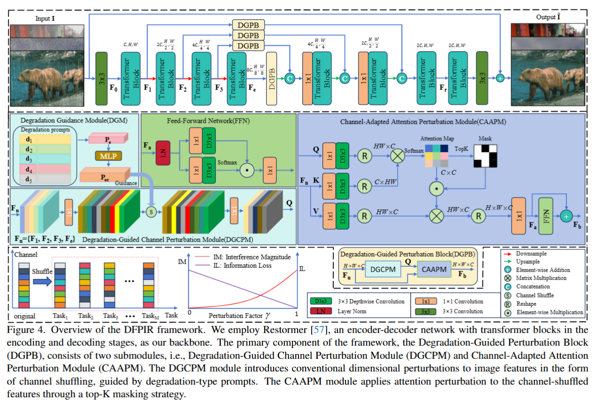
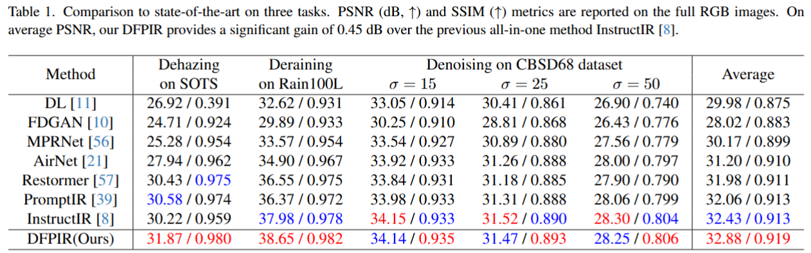
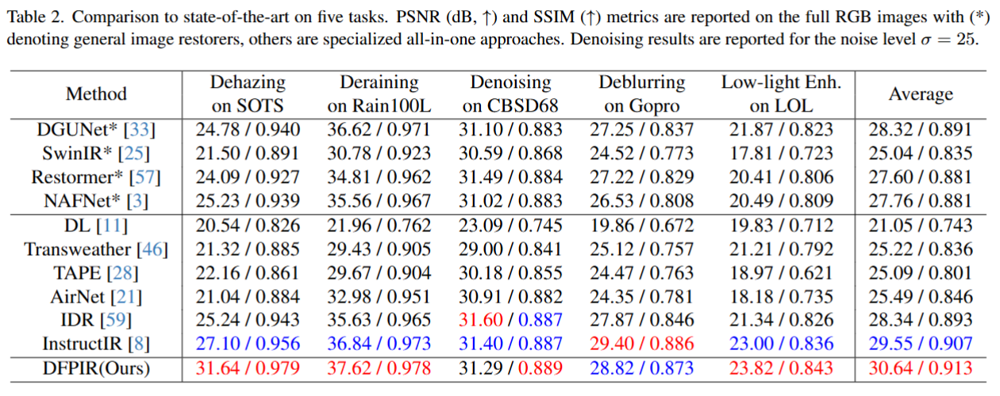
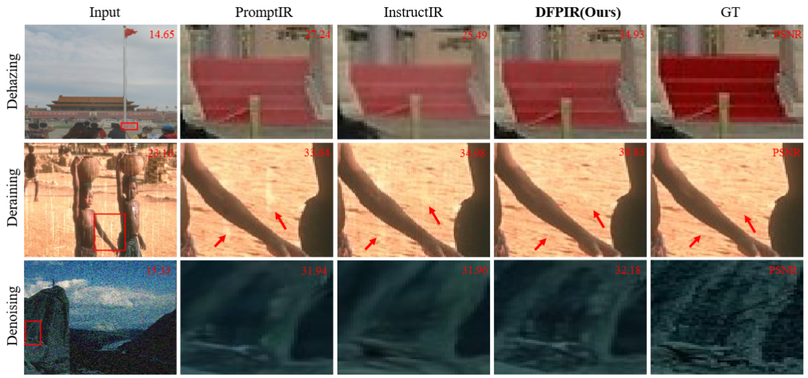
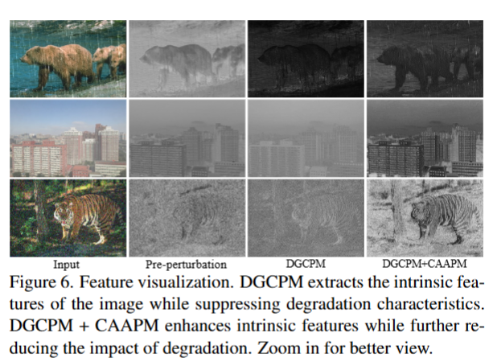
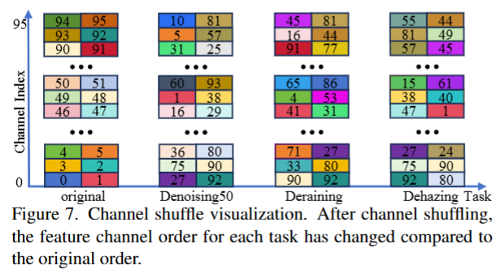
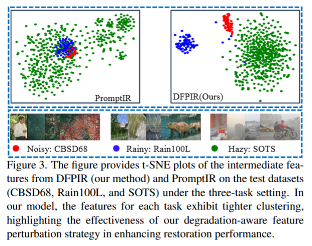
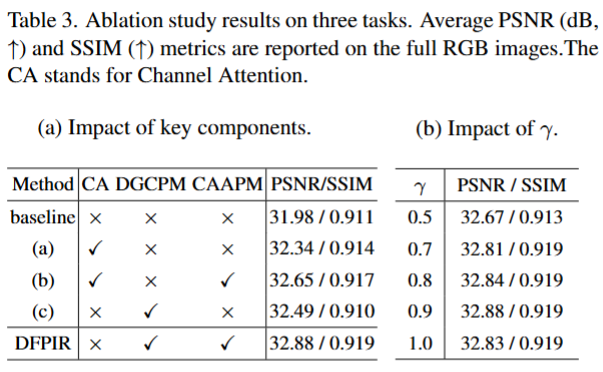

# [CVPR 2025] Degradation-Aware Feature Perturbation for All-in-One Image Restoration
## 面向一体化图像复原的退化感知特征扰动

论文链接：https://openaccess.thecvf.com/content/CVPR2025/html/Tian_Degradation-Aware_Feature_Perturbation_for_All-in-One_Image_Restoration_CVPR_2025_paper.html

---

## 1. 论文背景

论文围绕“一体化（All-in-One）图像恢复”的研究需求、现有方法局限及核心挑战展开，旨在解决多退化类型下**统一模型**的任务干扰问题。

#### 图像恢复领域的发展与需求
- 图像恢复是计算机视觉基础任务，核心目标是从退化（如噪声、雾霾、雨水、模糊、低光等）图像中恢复清晰图像。
- 早期及近期主流研究聚焦**单退化任务**，深度学习方法（如Restormer、NAFNet）在去噪、去雾等单一任务中取得显著进展，但仅适用于特定退化场景，难以泛化到多种退化共存的实际情况。
- 实际应用中，图像常面临多种退化叠加（如雨天+模糊、低光+噪声），因此研究重心逐渐转向**多退化恢复**，而传统多退化方法需为每种退化设计独立网络，导致模型体积大、计算成本高，难以落地。

#### 一体化图像恢复的现有路径及局限
为解决多退化恢复的效率问题，“一体化图像恢复”（统一模型处理多种退化）成为研究热点，现有方法可分为两类，均存在明显不足：
- **路径1：修改参数空间以适配多退化**：通过增加额外退化参数或设计复杂网络结构（如多解码器、知识迁移机制），让模型适配不同退化。但该路径会大幅提升计算复杂度，模型扩展性差。
- **路径2：修改特征空间以对齐统一参数**：通过引入退化提示（Prompt）调制特征，让特征空间适配共享参数网络，是当前更主流的路径，但现有方法存在缺陷：
  - PromptIR：依赖隐式提示，忽略退化类型的直接影响，难以减轻多退化间的相互干扰；
  - MedIR：采用“硬路由”策略，虽减少任务干扰，但可能忽略图像固有特征；
  - InstructIR：通过文本提示的通道注意力调制特征，对跨退化干扰的抑制效果有限。

一体化图像恢复的关键矛盾的是：**如何在保留图像固有特征以保证恢复质量的同时，减轻不同退化类型间的“任务干扰”**（因共享参数导致不同退化的梯度更新方向分歧，相互影响恢复效果）。现有方法难以平衡二者，要么干扰抑制不足，要么损失图像固有特征，这是论文亟待解决的核心问题。

---

## 2. 论文所提方法
DFPIR（Degradation-Aware Feature Perturbation for All-in-One Image Restoration）的核心目标是：在**统一参数空间**下，通过“退化感知的特征扰动”调整特征空间，解决多退化类型（如去噪、去雾、去雨等）的任务干扰问题，同时保留图像固有特征，最终实现通用的图像恢复。该方法以Restormer为骨干网络，核心创新在于引入了**退化引导扰动块（Degradation-Guided Channel Perturbation Module，DGPB）**，通过通道级和注意力级双维度扰动，让特征空间与统一参数空间对齐。

### 2.1 整体流程
DFPIR的整体处理流程围绕“编解码器+退化引导扰动”展开，具体步骤如下：
1. **输入与浅特征提取**：给定退化输入图像 \( I \in \mathbb{R}^{H \times W \times 3} \)（\( H,W \) 为空间尺寸，3为RGB通道），首先通过3×3卷积层提取浅特征 \( F_0 \in \mathbb{R}^{H \times W \times C} \)（\( C \) 为特征通道数）。
2. **4级编解码器网络**：浅特征 \( F_0 \) 送入4级编解码器，编码器通过Transformer块逐步降低空间分辨率、提升通道容量（最终得到低分辨率 latent 特征 \( F_e \in \mathbb{R}^{\frac{H}{8} \times \frac{W}{8} \times 8C} \)）；解码器则逐步恢复高分辨率输出，同时通过**跳接连接（skip connections）** 融合编码器特征，辅助恢复细节。
   - 编解码器各层Transformer块数量为 [4,6,6,8]（从顶层到底层递增），兼顾计算效率与特征表达能力。
3. **DGPB的插入位置**：在编码器与解码器之间的**跳接阶段**插入4个退化引导扰动块（DGPB），对编码后的特征进行扰动调制，使其与共享参数的解码器对齐。
4. **退化类型提示获取**：通过预训练的CLIP模型，将“退化类型文本描述”（如“noisy”“hazy”）编码为退化提示 \( P_e \)，为DGPB提供扰动指导。

整体流程的核心逻辑：通过编解码器提取通用特征，再通过DGPB根据退化类型自适应调整特征，既保留图像固有信息，又抑制不同退化类型间的干扰。

### 2.2 退化引导扰动块（Degradation-Guided Perturbation Block, DGPB）
DGPB是DFPIR的核心组件，输入为编码器输出特征 \( F_n \in \mathbb{R}^{\hat{H} \times \hat{W} \times \hat{C}} \) 和退化提示 \( P_e \in T^{\hat{L} \times 1} \)，输出为扰动后的特征 \( F_b \)，其整体计算过程如公式所示：
\[ F_b = CAAPM\left(DGCPM\left(F_n, DGM\left(P_e\right)\right), F_n\right) \]
其中，DGPB包含两个关键子模块：**退化引导通道扰动模块（DGCPM）** 和 **通道自适应注意力扰动模块（CAAPM）**，二者串联工作，分别实现通道级和注意力级扰动。

#### 2.2.1 退化引导通道扰动模块（Degradation-Guided Channel Perturbation Module, DGCPM）

通过“高维空间通道洗牌”，为不同退化类型分配独特的通道顺序，在不损失图像固有特征的前提下，减少不同退化特征间的干扰。（低维空间直接洗牌会导致扰动过大，网络难以收敛）

#### 具体步骤
1. **通道数翻倍（Convk）**：首先对输入特征 \( F_n \) 进行通道数翻倍操作（从 \( \hat{C} \) 到 \( 2\hat{C} \)），得到高维特征 \( F_{2n} \in \mathbb{R}^{\hat{H} \times \hat{W} \times 2\hat{C}} \)，为通道洗牌提供足够空间。
2. **退化提示维度匹配（DGM）**：通过退化引导模块（DGM）——一个包含两层线性层的MLP，将退化提示 \( P_e \) 转换为与高维特征通道数一致的向量 \( P_{ec} \in T^{2\hat{C} \times 1} \)，确保退化信息能直接指导通道排序。
3. **Top-K通道洗牌（CStopK）**：根据 \( P_{ec} \) 的Top-K（\( K=2\hat{C} \)）值获取通道索引，按该索引对 \( F_{2n} \) 的通道进行重新排序，实现“退化类型自适应的通道洗牌”。
4. **通道数减半（Convh）**：洗牌后将通道数减半（从 \( 2\hat{C} \) 回到 \( \hat{C} \)），确保特征维度与后续模块兼容。

#### 数学表达
\[ Q = Convh\left( CS_{topK}\left( Convk\left(F_n\right) \mid DGM\left(P_e\right) \right) \right) \]
其中，\( Q \in \mathbb{R}^{\hat{H} \times \hat{W} \times \hat{C}} \) 为DGCPM的输出特征，\( CS_{topK} \) 表示退化引导的Top-K通道洗牌操作。

通道洗牌仅调整通道顺序，不改变通道内的特征信息，因此能最大程度保留图像固有特征，同时通过“不同退化类型对应不同通道顺序”，减少跨退化任务的特征干扰。

#### 2.2.2 通道自适应注意力扰动模块（Channel-Adapted Attention Perturbation Module，CAAPM）

解决DGCPM输出的“洗牌特征”与原始特征缺乏信息交互的问题，同时在注意力维度添加扰动，进一步抑制退化特征干扰。

#### 具体步骤
1. **跨注意力特征聚合**：借鉴Restormer的通道注意力机制，设计跨注意力模块：以DGCPM输出的洗牌特征 \( Q \) 为查询（Query），以原始编码器特征 \( F_n \) 为键（Key）和值（Value），实现洗牌特征与原始特征的信息融合。
2. **注意力掩码扰动**：引入掩码矩阵 \( M \in \mathbb{R}^{\hat{C} \times \hat{C}} \)，通过Top-K策略选择部分注意力图（未选中位置设为0，选中设为1），对注意力图进行选择性屏蔽，实现注意力级扰动。
   - 扰动因子 \( \gamma \) 用于平衡“任务干扰抑制”和“信息损失”，实验中固定为0.9（消融实验验证该值最优）。
3. **扰动注意力图计算**：如公式（3）所示，通过掩码矩阵与注意力图的逐元素乘法，得到扰动后的注意力图 \( PAM \)：
\[ PAM(Q, K, V) = softmax\left( M \odot \left( Q_* K_*^T / \sqrt{d_k} \right) \right) V_* \]
其中，\( Q_* \)、\( K_* \)、\( V_* \) 分别为查询、键、值的特征映射，\( d_k \) 为注意力头维度，\( \odot \) 表示逐元素乘法。
4. **特征输出**：通过1×1卷积将扰动注意力图转换为特征 \( F_a \)，再经过前馈网络（FFN）增强特征表达，最终输出：
\[ F_b = F_a + FFN\left(F_a\right) \]

通过“注意力掩码”直接丢弃与当前退化任务无关的注意力信息，进一步抑制跨退化干扰；同时通过FFN增强特征的非线性表达能力，提升恢复质量。

### 2.3 特征扰动策略分析

论文中分析了特征扰动策略，DFPIR的特征扰动策略包含**通道级**和**注意力级**两个维度，二者协同工作，实现“保留固有特征+抑制退化干扰”的平衡。

#### 2.3.1 通道级扰动策略（通过DGCPM实现）
- **设计逻辑**：低维空间通道洗牌会导致扰动过大，网络难以收敛；高维空间洗牌则能在足够的特征维度中为不同退化任务分配独特通道顺序，避免干扰。
- **具体实现**：对含 \( N \) 个通道的特征 \( F_{nc} = \{C_1, C_2, ..., C_N\} \)，为 \( M \) 个退化任务分别分配独特的通道索引向量 \( S^N = \{S_1^N, S_2^N, ..., S_N^N\} \)，洗牌后特征为 \( F_m = \{C_{S_1^N}, C_{S_2^N}, ..., C_{S_N^N}\} \)。
- **优势**：通道顺序自适应于退化提示，既不损失通道特征（仅重排），又能减少跨退化任务的特征干扰。

#### 2.3.2 注意力级扰动策略（通过CAAPM实现）
- **设计逻辑**：DGCPM的通道洗牌仅能部分减少退化干扰，而注意力级扰动通过“主动丢弃无关注意力”，进一步抑制退化特征的负面影响。
- **具体实现**：计算跨注意力图 \( A_{tt} \in \mathbb{R}^{\hat{C} \times \hat{C}} \)，对每列注意力值进行Top-K选择，生成掩码矩阵 \( M \)，通过 \( A_{ttn} = A_{tt} \odot M \) 得到扰动后的注意力图。
- **优势**：直接针对“与当前退化无关的注意力信息”进行屏蔽，精准抑制干扰，同时保留与图像固有特征相关的注意力权重。

---

## 3. 实验部分

### 3.1 实验设置（Experimental Settings）
#### 数据集
- **单任务数据集**：训练集与测试集按领域标准配置，去噪用BSD400+WED训练、CBSD68+Urban100测试；去雾用SOTS数据集；去雨用Rain100L；去模糊用GoPro；低光增强用LOL-v1。
- **一体化数据集**：训练时合并上述所有单任务训练集，测试直接在对应单任务测试集上进行，无需单独适配。

#### 实现细节
- 骨干网络：采用Restormer，4级编解码器结构，各层Transformer块数量为[4,6,6,8]。
- 训练配置：PyTorch框架，单NVIDIA RTX 3090 GPU；初始训练80轮（学习率1e-4，patch尺寸128²，batch size=5），微调5轮（学习率1e-5，patch尺寸192²，batch size=3）。
- 优化策略：L1损失函数+Adam优化器（β₁=0.9，β₂=0.999），数据增强采用随机水平/垂直翻转。
- 评估指标：PSNR（峰值信噪比，越高越好）和SSIM（结构相似性，越高越好），均基于全RGB图像计算。

### 3.2 三任务对比结果（Three Tasks Comparison）

涵盖去雾（SOTS）、去雨（Rain100L）、去噪（CBSD68，σ=15/25/50）三大核心任务，对比8种主流方法（含Restormer、InstructIR等一体化模型）。

### 3.3 五任务对比结果（Five Tasks Comparison）

新增去模糊（GoPro）、低光增强（LOL）任务，共五任务，对比11种方法（含通用恢复模型与一体化模型）。

### 3.4 视觉结果

- 去雾任务：在强雾霾场景中，相比PromptIR和InstructIR，能更彻底去除雾效，同时保留图像细节（如建筑物边缘、纹理）。
- 去雨任务：恢复结果更接近真实清晰图像（GT），减少雨痕残留和背景模糊。
- 去噪任务：对高噪声（σ=50）图像，能更好恢复细节（如纹理、边缘），避免过度平滑。

可视化验证:
- 特征可视化：DGCPM模块能提取图像固有特征、抑制退化干扰；叠加CAAPM后，固有特征进一步增强，退化干扰更弱。

- 通道洗牌可视化：不同退化任务（去噪、去雨、去雾）的通道顺序的差异明显，验证了通道级扰动的自适应有效性。

- t-SNE特征聚类：DFPIR的各任务特征聚类更紧密，说明退化感知扰动能有效分离不同退化的特征空间。

### 3.5 消融实验

基于三任务场景，验证DGPB核心模块的作用：

